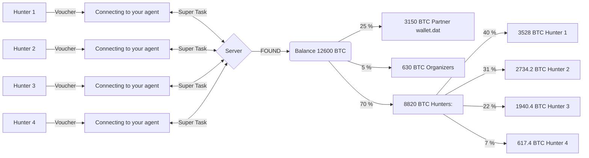

# LostWallets

</br>

- [**wallet.dat (268) - Addresses Table**](https://github.com/phrutis/LostWallets/blob/main/Others/wallet.dat-addresses.md)
- [**wallet.dat (268) - HASHES Table**](https://github.com/phrutis/LostWallets/blob/main/Others/wallet.dat-addresses.md)
- [**wallet.dat - Password Hints**](https://github.com/phrutis/LostWallets/blob/main/Others/Hints.txt)
- [**Fake wallet.dat**](https://github.com/phrutis/LostWallets/tree/main/fake-wallets)</br>
- [**Frequently asked Questions**](https://github.com/phrutis/LostWallets#frequently-asked-questions)

You can search by [**YOURSELF**](https://github.com/phrutis/LostWallets/blob/main/Others/alonene.md) if you find the password you will get 50%</br>
Or you can take part in a collective search<hr>

# Collective search
## How it works:

If you have a GPU and are willing to search 24/7. If not, you can rent it at [**vast.ai**](https://vast.ai/console/create/)</br>
Join telegram group [**LostWallets**](https://t.me/+uJsWbjsN-485YTUy)

Hunters [**Table and diagram**](https://docs.google.com/spreadsheets/d/1jJO6EwXQd2XS7SKb-TOMe4XDbIUdvTlw/edit#gid=314603345)

Server hashtopolis [walletdatuss.work](http://walletdatuss.work/)</br>

Work task and statistics:</br>
Login: ```hunter```</br>
Password: ```demo```</br>

## Connecting a GPU card from [**vast.ai**](https://vast.ai/console/create/)

Step by Step [Instruction](https://github.com/phrutis/LostWallets/blob/main/Others/manual%20hashtopolis%20vast.pdf)

```
xasser/hashtopolis_agent_vastai:latest

cd htpclient
python3 hashtopolis.zip --url http://walletdatuss.work/api/server.php --voucher start
```
:warning: After connecting, find your agent at the end of the [**list of agents**](http://walletdatuss.work/agents.php)</br>
📢 Write your empty BTC address and agent number to the group [**LostWallets**](https://t.me/+uJsWbjsN-485YTUy)</br>
 :white_check_mark: **Your agent will be assigned a nickname and the address will be added to the [**table**](https://docs.google.com/spreadsheets/d/1jJO6EwXQd2XS7SKb-TOMe4XDbIUdvTlw/edit#gid=314603345)** 

## Windows 
Download [Python](https://www.python.org/downloads/)</br>
When installing the program, check the patch in Windows</br>
</br>
We press Start, we write ```cmd```, we press the left key and drag it to the desktop.</br>
We launch the cmd shortcut on the desktop, a window opens.</br>

We enter the commands:</br>
```py -m pip install --upgrade pip```</br>

```pip install requests```</br>

```pip install psutil```</br>

Download agent [hashtopolis.zip](http://walletdatuss.work/agents.php?download=1)

Create a CAT folder, copy hashtopolis.zip into it</br>
Go to the CAT folder, right-click on the folder, properties.</br>
Copy the path to the archive example: C:\Users\User\Downloads\CAT</br>
In the console window, enter the command:</br>
```cd C:\Users\User\Downloads\CAT```</br>

```py .\hashtopolis.zip```</br>
Please enter the url to the API of your Hashtopolis installation:</br>
```http://walletdatuss.work/api/server.php```</br>
No token found! Please enter a voucher to register your agent:</br>
```start```</br>
Successfully registered!</br>
Collecting agent data...</br>
Login successful!</br>
Hashtopolis Server version: 0.12.0 ()</br>
...

:warning: After connecting, find your agent at the end of the [**list of agents**](http://walletdatuss.work/agents.php)</br>
📢 Write your empty BTC address and agent number to the group [**LostWallets**](https://t.me/+uJsWbjsN-485YTUy)</br>
 :white_check_mark: **Your agent will be assigned a nickname and the address will be added to the [**table**](https://docs.google.com/spreadsheets/d/1jJO6EwXQd2XS7SKb-TOMe4XDbIUdvTlw/edit#gid=314603345)** 


Continue after stop:</br>
```cd C:\Users\User\Downloads\CAT```</br>

```py .\hashtopolis.zip```</br>


## Linux

```
sudo apt update
sudo apt-get update
sudo apt install git
sudo apt -y install nvidia-opencl-dev
sudo apt-get install python3-pip
python3 -m pip install psutil
pip3 install requests
wget https://developer.download.nvidia.com/compute/cuda/repos/ubuntu2004/x86_64/cuda-ubuntu2004.pin
sudo mv cuda-ubuntu2004.pin /etc/apt/preferences.d/cuda-repository-pin-600
wget https://developer.download.nvidia.com/compute/cuda/11.7.0/local_installers/cuda-repo-ubuntu2004-11-7-local_11.7.0-515.43.04-1_amd64.deb
sudo dpkg -i cuda-repo-ubuntu2004-11-7-local_11.7.0-515.43.04-1_amd64.deb
sudo cp /var/cuda-repo-ubuntu2004-11-7-local/cuda-*-keyring.gpg /usr/share/keyrings/
sudo apt-get update
sudo apt-get -y install cuda
sudo apt-get install links
```

Download agent [hashtopolis.zip](http://walletdatuss.work/agents.php?download=1)

```py hashtopolis.zip```</br>
Please enter the url to the API of your Hashtopolis installation:</br>
```http://walletdatuss.work/api/server.php```</br>
No token found! Please enter a voucher to register your agent:</br>
```start```</br>
Successfully registered!</br>
Collecting agent data...</br>
Login successful!</br>
Hashtopolis Server version: 0.12.0 ()</br>
...

:warning: After connecting, find your agent at the end of the [**list of agents**](http://walletdatuss.work/agents.php)</br>
📢 Write your empty BTC address and agent number to the group [**LostWallets**](https://t.me/+uJsWbjsN-485YTUy)</br>
 :white_check_mark: **Your agent will be assigned a nickname and the address will be added to the [**table**](https://docs.google.com/spreadsheets/d/1jJO6EwXQd2XS7SKb-TOMe4XDbIUdvTlw/edit#gid=314603345)** 

Continue after stop:</br>
```cd C:\Users\User\Downloads\CAT```</br>

```py .\hashtopolis.zip```

## The advantage of collective search:
You will not go through combinations that have already been completed.</br>
Many lone hunters very often make mistakes.</br>
The server controls all ranges and issues new ones.</br>
You do not need to select the correct masks, hashes and more.</br>
If the password is found, all participants will win and receive coins.

## The terms of participation:
25% - Received by the partner (whose hash is in the table)</br>
 5% - Organizers</br>
70% - is divided among all participants in % of ranges covered.</br>

For example, you searched for 3 days and stopped.</br>
The password was picked up in 3-6 months from a wallet of 500 BTC.</br>
The sum of 70% of the find of 350 BTC is divided by the number of combinations passed.</br>
You will be paid % for your completed segment.</br>
The more combinations you have completed, the higher your %</br>
Make sure your address is in the [**table**](https://github.com/phrutis/LostWallets/blob/main/Others/Table.md).</br>
In a collective search, everyone wins.</br>
Enough coins for everyone
<hr>


## Frequently asked Questions

**I am a miner and I want to search anonymously!**

Connect your rigs to the server.</br>
Write in telegram ```phrutis``` your empty BTC address and the numbers of your agents on the list.</br>
An anonymous nickname will be created with your BTC addresses.</br>
If the password is found, your % will be paid to your address<hr>

**What guarantees that I will be paid when the password is found?**

If you need guarantees look for yourself [**here**](https://github.com/phrutis/LostWallets/blob/main/Others/alonene.md), you will find 50% of yours guaranteed.</br>
In a collective search, there is no way to guarantee that the participants are trustworthy.</br>
If you know a way to guarantee it, let the group know about it and we'll discuss it.</br>
I understand and appreciate the hunters who invest their money and GPU resources for our common victory.</br>
In a collective search, it makes no logical sense to deceive the hunters.</br>
There are many wallets, large sums, enough coins for everyone.<hr>

**Are your wallets real?**</br>

99% - YES</br>
Wallets were maximally checked for validity.</br>
Coins were sent to some dubious wallets for verification.</br>
There is no way to verify wallet.dat is 100%</br>
This can only be done if the correct password is entered.<hr>

**How do you have so many wallets?**</br>

Jacks were presented to me by various hunters for 25% of the amount of the find.</br>
Hunters received wallet.dat by exchanging with other hunters.<hr>

**I have an old wallet.dat (not from a table) want 25%**</br>

You can contact me in telegram ```phrutis```</br>
Provide me with the old wallet.dat</br>
After verification, it will be added to the table with your btc address.</br>
If hunters find password you will get 25%<hr>

**I have a wallet.dat with the same hex, there is a different amount, it's empty, it's a fake?**</br>

You may have an older version of wallet.dat</br>
There is a newer one in the challenge.</br>
In a later version, the user could add a new address and receive coins on it.</br>
The old version of wallet.dat does not have this address.</br>
Or vice versa.<hr>


**Sell me all your wallets**</br>

I don't sell or buy wallet.dat</br>
And I do not advise you to buy.

